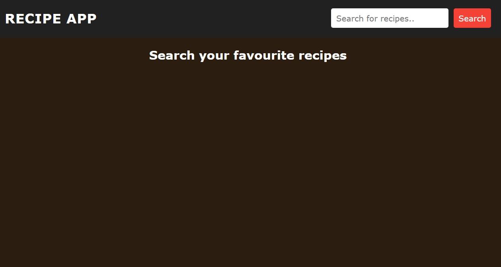
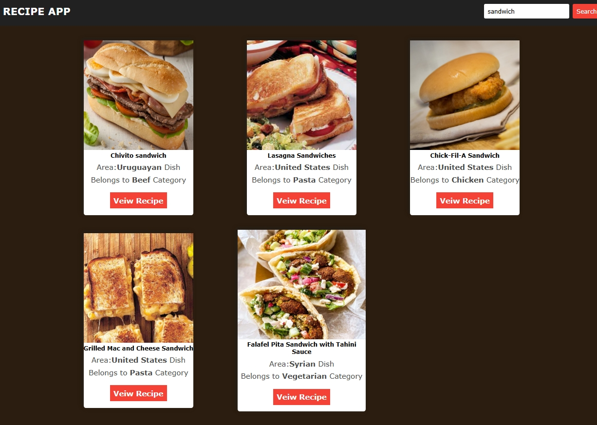
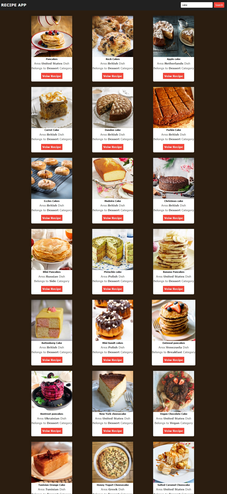
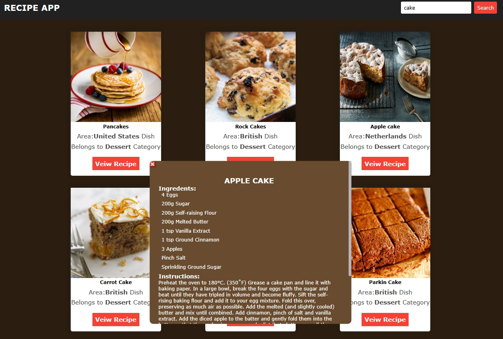
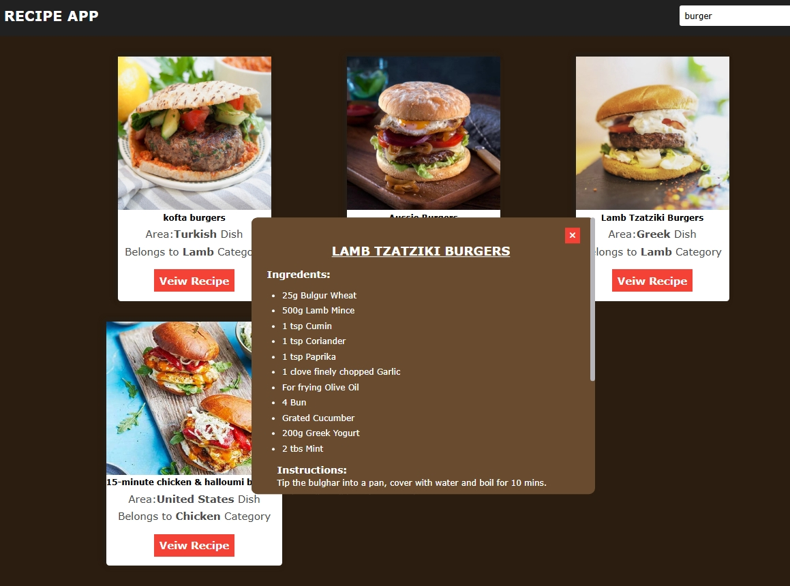

##  Start Date

    [03/6/2026]  


## 🍽️ Recipe App

A simple and responsive Recipe App built using HTML, CSS, and JavaScript. Users can search for recipes and view recipe details using a public Recipe API.

## 🚀 Features

- Search recipes by name
- Fetch data from Recipe API
- Display recipe cards dynamically
- Responsive UI design
- Easy-to-use interface

## 🛠️ Technologies Used

- HTML5
- CSS3
- JavaScript (ES6)
- Recipe API   https://www.themealdb.com

## 📸 Screenshots

;




.jpeg)


## 🔧 Installation

1. Clone the repository
```bash
git clone https://github.com/uvais8958/recipe-app.git
```

2. Open the project folder

3. Run `index.html` in your browser

## 🚧 Project Status

Completed

## 👨‍💻 Author

             Uvais Ansari

         GitHub: https://github.com/uvais8958

## ⭐ Support

If you like this project, give it a star on GitHub.


##  project-End-Date
                
        [05/6/2026]